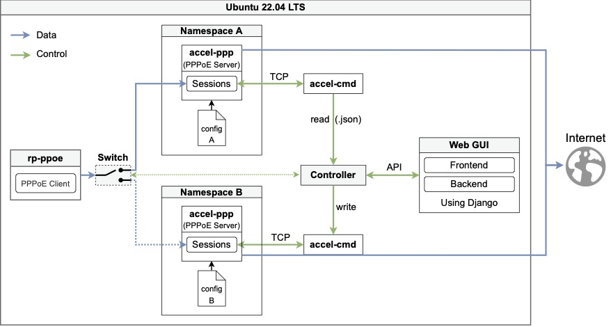

# LabProject T6 WiSe22-23 Code

The source code of this repository was used as proof-of-concept for a system able to automatically migrating sessions from a primary PPPoE server to a backup PPPoE server in hot-standby.
Once the failure of the primary PPPoE server is detected, traffic can be redirected to the backup  the PPPoE server.



- [Getting started with Accel-PPP](#getting-started-with-accel-ppp)
  - [Install Dependencies](#install-dependencies)
  - [Accel-PPP Server](#accel-ppp-server)
    - [Install Accel-PPP](#install-accel-ppp)
    - [Run Accel-PPP](#run-accel-ppp)
    - [Run Accel-PPP inside Namespace](#run-accel-ppp-inside-namespace)
    - [Read Session from Accel-PPP](#read-session-from-accel-ppp)
    - [Terminate Session from Accel-PPP](#terminate-session-from-accel-ppp)
    - [Write Session to Accel-PPP](#write-session-to-accel-ppp)
  - [Setup namespaces](#setup-namespaces)
    - [Useful references to namespaces](#useful-references-to-namespaces)
    - [Setup namespaces with script](#setup-namespaces-with-script)
    - [Setup namespaces manually](#setup-namespaces-manually)
- [PPPoE Client](#pppoe-client)
  - [Simulate PPPoE connection with rp-pppoe](#simulate-pppoe-connection-with-rp-pppoe)
    - [Setup rp-pppoe](#setup-rp-pppoe)
    - [Use rp-pppoe](#use-rp-pppoe)
  - [Simulate PPPoE connection with `pppoe_client.py`](#simulate-pppoe-connection-with-pppoe_clientpy)
    - [Install Dependencies](#install-dependencies-1)
    - [Run client](#run-client)
  - [Simulate PPPoE connection with PfSense](#simulate-pppoe-connection-with-pfsense)
    - [Setup](#setup)
- [Controller](#controller)
  - [Install Dependencies](#install-dependencies-2)
  - [Start Controller](#start-controller)
- [Web GUI](#web-gui)
  - [Install Dependencies](#install-dependencies-3)
  - [Start Web Gui](#start-web-gui)
- [Useful commands](#useful-commands)
  - [Check running processes](#check-running-processes)
  - [Namespaces](#namespaces)


## Getting started with Accel-PPP

### Install Dependencies

1. [Install Ubuntu 22.04 as Virtual Machine in VirtualBox](https://ubuntu.com/tutorials/how-to-run-ubuntu-desktop-on-a-virtual-machine-using-virtualbox)
2. Update

    `sudo apt update`

    `sudo apt upgrade`

3. [Install the VirtualBox guest additions](https://www.pragmaticlinux.com/2022/04/install-the-virtualbox-guest-additions-in-ubuntu-22-04/)

4. [Install dependencies for accel-ppp](https://docs.accel-ppp.org/en/latest/installation/install.html):
   
    `sudo apt install git cmake build-essential linux-headers-$(uname -r) libsnmp-dev lua* libpcre3-dev`


### Accel-PPP Server
Accel-PPP is used as PPPoE Server, follow this instructions to install and run Accel-PPP.

#### Install Accel-PPP
1. `git clone https://dev.kom.e-technik.tu-darmstadt.de/gitlab/acs/lab/labproject-t6-wise22-23-code.git`
2. `cd labproject-t6-wise22-23-code`
3. `cd Accel-PPP-Modified`
4. `./compile_deb.sh`

The `compile_deb.sh` script generates a debian package and installs it automatically.

#### Run Accel-PPP

To run a single instance of Accel-PPP:

1. `cd build`
2. Dann sollte accel-ppp ausführbar sein:

    `sudo accel-pppd -c ../accel-pppd/accel-ppp.conf -p /var/run/accel-ppp.pid`


#### Run Accel-PPP inside Namespace

To run two instances of Accel-PPP in two distinct namespaces, the -p flag needs to lead to different pid paths:

1. `cd Accel-PPP-Modified`
2. Run accel-pppp on `NamespaceA`:

    `sudo ip netns exec NamespaceA accel-pppd -c accel-pppd/accel-ppp_A.conf -p /var/run/accel-ppp-A.pid`

2. Run accel-pppp on `NamespaceB`:

    `sudo ip netns exec NamespaceB accel-pppd -c accel-pppd/accel-ppp_B.conf -p /var/run/accel-ppp-B.pid`


#### Read Session from Accel-PPP

Get sessions of Accel-PPP as JSON sting:

`accel-cmd -H IP_WHERE_ACCEL_RUNS pppoe show states`

`accel-cmd -H 192.168.42.1 pppoe show states`

`accel-cmd -H 192.168.43.1 pppoe show states`


Show sessions as table in terminal:

`accel-cmd -H 192.168.42.1 show sessions`

`accel-cmd -H 192.168.43.1 show sessions`


#### Terminate Session from Accel-PPP

> ⚠️ Terminating dummy sessions will lead to the server crashing.

Terminate all session (if there are dummy sessions, the server will crash):

    `accel-cmd -H IP_WHERE_ACCEL_RUNS terminate all`

    `accel-cmd -H 192.168.42.1 terminate all` 

    `accel-cmd -H 192.168.43.1 terminate all`


Terminate Session by username (only works with real sessions, with dummy sessions the Server will crash):

    `accel-cmd -H IP_WHERE_ACCEL_RUNS terminate username USERNAME_OF-SESSION`

    `accel-cmd -H 192.168.42.1 terminate username test ` --> Terminate session with username test.


Terminate Session by (only works with real sessions, with dummy sessions the Server will crash):

    `accel-cmd -H IP_WHERE_ACCEL_RUNS terminate sid session_id`

    `accel-cmd -H 192.168.42.1 terminate sid 4c906bc821e09873`

> ⚠️ The sid needed for this command has to be taken from: `accel-cmd -H 192.168.42.1 show sessions` and not `accel-cmd -H 192.168.42.1 pppoe show states`.


#### Write Session to Accel-PPP

`accel-cmd pppoe write states $username $ip $peer_ip $session_id $calling_station_id $called_station_id`

`accel-cmd -H 192.168.43.1 pppoe write states USERNAME 1.2.6.42 5.3.6.13 46 33 12 33 44 55 66 99 255 99 255 99 251`

> ⚠️ The MAC adressess in the attributes `$calling_station_id` and  `$called_station_id` must be given as integer separated with spaces.
> 
> Example: Instead of `ff:ff:ff:ff:ff:ff` --> `255 255 255 255 255 255`


> ⚠️ Sessions can only be written to an Accel-PPP instance if there is at least one session in server. 

> Note: Instead of using `accel-cmd` sessions can also be written directly via TCP.


### Setup namespaces

To run two Accel-PPP instances separately, they need to run in two namespaces.
With the following two namespace are created and linked to the host.

> ⚠️ Namespaces need to be setup again after reboot of host.

#### Useful references to namespaces
- [Create Your Own Network Namespace](https://itnext.io/create-your-own-network-namespace-90aaebc745d)
- [Network Namespaces - Simplified Learning](https://www.waytoeasylearn.com/learn/network-namespaces/)
- [StackExchange - Namespace Configuration](https://serverfault.com/a/973524)


#### Setup namespaces with script
The fastest and easiest way to setup the correct namespaces.

1. `cd labproject-t6-wise22-23-code/Accel-PPP-Modified/`
2. `./create_namespaces.sh`

#### Setup namespaces manually
If you want to setup the namespaces manually instead:

1. Add first namespace:

    `sudo ip netns add NamespaceA`

2. Add second namespace:

    `sudo ip netns add NamespaceB`

3. Show all of the named network namespaces:

    `ip netns list`

4. Create a virtual cable (aka. pipe or pair of virtual interfaces) for between Client and NamespaceA:

    `sudo ip link add dev veth-A-Client type veth peer name veth-A`

5. Create a virtual cable (aka. pipe or pair of virtual interfaces) for between Client and NamespaceB:

    `sudo ip link add dev veth-B-Client type veth peer name veth-B`

6. Attach interface `veth-A` to namespace `NamespaceA`:

    `sudo ip link set veth-A netns NamespaceA`

7. Attach interface `veth-B` to namespace `NamespaceB`:

    `sudo ip link set veth-B netns NamespaceB`

8. Display all network interfaces of namespace `NamespaceA`:

    `sudo ip netns exec NamespaceA ip link`

9. Display all network interfaces of namespace `NamespaceB`:

    `sudo ip netns exec NamespaceB ip link`

10. Assign IP address to interface `veth-A` of `NamespaceA`:

    `sudo ip -n NamespaceA addr add 192.168.42.1/24 dev veth-A` 


11. Assign IP address to interface `veth-B` of `NamespaceB`:

    `sudo ip -n NamespaceB addr add 192.168.43.1/24 dev veth-B` 

12. Assign IP address to interface `veth-A-Client`:

    `sudo ip addr add 192.42.0.1/24 dev veth-A-Client` 

13. Assign IP address to interface `veth-B-Client`:

    `sudo ip addr add 192.43.0.1/24 dev veth-B-Client` 


14. Bring up the interfaces:
```
sudo ip link set veth-A-Client up
sudo ip link set veth-B-Client up
sudo ip -n NamespaceA link set veth-A up
sudo ip -n NamespaceB link set veth-B up

sudo ip -n NamespaceA link set up dev lo
sudo ip -n NamespaceB link set up dev lo
```

15. Verify if IP address configured:
```
ip address show
sudo ip netns exec NamespaceA ip address show
sudo ip netns exec NamespaceB ip address show
```

16. Setup routes: 

    `sudo ip -n NamespaceA route add 192.42.0.0/24 dev veth-A`

    `sudo ip route add 192.168.42.0/24 dev veth-A-Client`

    `sudo ip -n NamespaceB route add 192.43.0.0/24 dev veth-B`

    `sudo ip route add 192.168.43.0/24 dev veth-B-Client`


17. Check existence of routes:

    `sudo ip -n NamespaceA route get 192.42.0.1`

    `sudo ip route get 192.168.42.1`

    `sudo ip -n NamespaceB route get 192.43.0.1`

    `sudo ip route get 192.168.43.1`

    Or

    `ip r g 192.42.0.1  from 192.168.42.1 iif veth-A-Client`

    `ip r g 192.43.0.1  from 192.168.43.1 iif veth-B-Client`


18. Test the links with ping:
```
ping 192.168.42.1
ping 192.168.43.1
sudo ip netns exec NamespaceA ping 192.42.0.1
sudo ip netns exec NamespaceB ping 192.43.0.1
```

19. `tcpdump` can be used to capture the packets transmitted between two network namespace:

    `sudo tcpdump -i veth-A-Client -nve`

    `sudo ip netns exec NamespaceA tcpdump -i veth-A -nve`

    `sudo tcpdump -i veth-B-Client -nve`

    `sudo ip netns exec NamespaceB tcpdump -i veth-B -nve`


## PPPoE Client
PPPoE clients can be simulated using the following solutions:

### Simulate PPPoE connection with [rp-pppoe](https://linux.die.net/man/8/pppoe)

#### Setup rp-pppoe
1. Install pppoe: `sudo apt install pppoe`
2. Setup username and password for pppoe connections with:
   1. Run `pppoeconf veth-A-Client`
   2. `OKAY TO MODIFY` dialog -->  Yes (press enter)
   3. `POPULAR OPTIONS` dialog -->  Yes (press enter)
   4. Enter Username: `test`
   5. Enter password: `secretPassword`
   6. `USE PEER DNS` Dialog -->  Yes (press enter)
   7. `LIMITED MSS PROBLEM` Dialog -->  Yes (press enter)
   8. `Your PPPD is configured now. Would you like to start the connection at boot time?` --> No
   9.  `ESTABLISH A CONNECTION` --> No
   10. Done
3. Move `pppoe.conf` to  `/etc/ppp/` with:

    `sudo cp -i PPPoE-Client/pppoe.conf /etc/ppp/pppoe.conf`

Now the configuration file is stored at `/etc/ppp/pppoe.conf` and the username and password is store inside `/etc/ppp/pap-secrets`.

#### Use rp-pppoe

Start PPPoE client:

`sudo pppoe-start`

Show status of PPPoE client:

` pppoe-status`

Stop the PPPoE client:

`sudo pppoe-stop`

Start only a pppoe discovery connection:

`pppoe -I veth-A-Client -d`

`pppoe -I veth-B-Client -d`

This will only do the discovery phase, no authentication will be done. Can be used to initialize Accel-PPP, so that [writing sessions to Accel-PPP](#write-session-to-accel-ppp) works.


### Simulate PPPoE connection with `pppoe_client.py`

> ⚠️ In our simulation environment this solution did not end up working. The PADO response from accel-ppp did not get processed by the script.  

#### Install Dependencies
1. Install Python 2: `sudo apt install python2`
2. Install python package-management system pip: `sudo apt install python-pip`
3. Install scapy: `sudo pip2 install --pre scapy[basic]`

#### Run client
1. Get mac address from veth-A-Client: `ip link show veth-A-Client`
2. Change to mac address in line 12 of `pppoe_client.py` to the one from veth-A-Client
3. `cd Accel-PPP-Modified`
4. `sudo python2 pppoe_client.py`


### Simulate PPPoE connection with PfSense

> ⚠️ PfSense was not used in this project so the instructions aren't complete.

#### Setup
1. [Install PfSense as virtual Machine in VirtualBox](https://www.ceos3c.com/pfsense/install-pfsense-on-virtualbox/)
2. ToDo: Link PfSense VM with Ubuntu VM


## Controller

The controller is used to detect failures of Accel-PPP and to migrate sessions between instances of Accel-PPP.

### Install Dependencies
1. Install Python 3, if not already installed:
   
    `sudo apt install python`

2. Install python package-management system pip:

   `sudo apt install python3-pip`

3. Install RPyC:

   `pip install -U rpyc`


### Start Controller
1. `cd Controller`
2. `python3 Controller.py`


## Web GUI

The web GUI can be used to monitor and control the Accel-PPP instances and the Controller.

### Install Dependencies
1. Install Python 3, if not already installed:
   
    `sudo apt install python`

2. Install python package-management system pip, if not already installed:

   `sudo apt install python3-pip`

3. Install Django:

   `pip install -U Django`


### Start Web Gui
1. Activate virtual environment:
    
    `cd Web-GUI-for-Controller`

    `source myenv/bin/activate`
 
2. `cd Web-GUI-for-Controller/mysite`
3. `python3 manage.py runserver`
4. Open http://127.0.0.1:8000 to see the GUI.

> ⚠️ Writing a dummy session could not working as expected or lead to accel-ppp stopping, if [rp-pppoe](#simulate-pppoe-connection-with-rp-pppoe) is not installed properly.
> This problem can be identified, if you get the following error message: `/bin/sh: 1: pppoe: Permission denied`.
> A fix would be to check the function `establish_connection()` of `Controller.py` and to add or remove `sudo` in the command called in the return statement.

> ⚠️ Four sessions can be displayed in the GUI without any problems. But as soon as there is a fifth one, the sessions can not be read correctly from accel-ppp. The JSON returned by accel-cmd which should contain all sessions, is clipped and incomplete. The interface of ACCEL-PPP for reading sessions is probably responsible for this problem.
> Because the sessions can't be read properly, the GUI will display the server as offline.


## Useful commands
Commands that were useful for this project.

### Check running processes

For debugging it can be helpful to check what processes are running.

Show all running processes:
`ps aux`

Show processes running the Controller:
`sudo ps aux | grep Controller.py`

Show processes running accel-ppp:
`sudo ps aux | grep accel`

Kill a process:
`sudo kill pid` (Replace pid with the process id)

### Namespaces

Display all network interfaces:
`ip link`

Add namespace with `NS_NAME` being the name you give the namespace:
`sudo ip netns add NS_NAME` 

Show all of the named network namespaces:
`ip netns list`

Display all network interfaces of namespace `NS_NAME`:
`sudo ip netns exec NS_NAME ip link`

If needed: delete virtual interface `eth-A`:
`sudo ip link delete dev veth-A`

Attach console to namespace:
`sudo ip netns exec NS_NAME bash`

Exit namespace in console:
`exit`

Move network interface `enp0s3` to namespace `NS_NAME`: 
`sudo ip link set enp0s3 netns NS_NAME`

Display all routs with:
`route -n` or `ip route`
